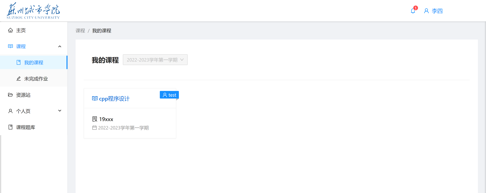
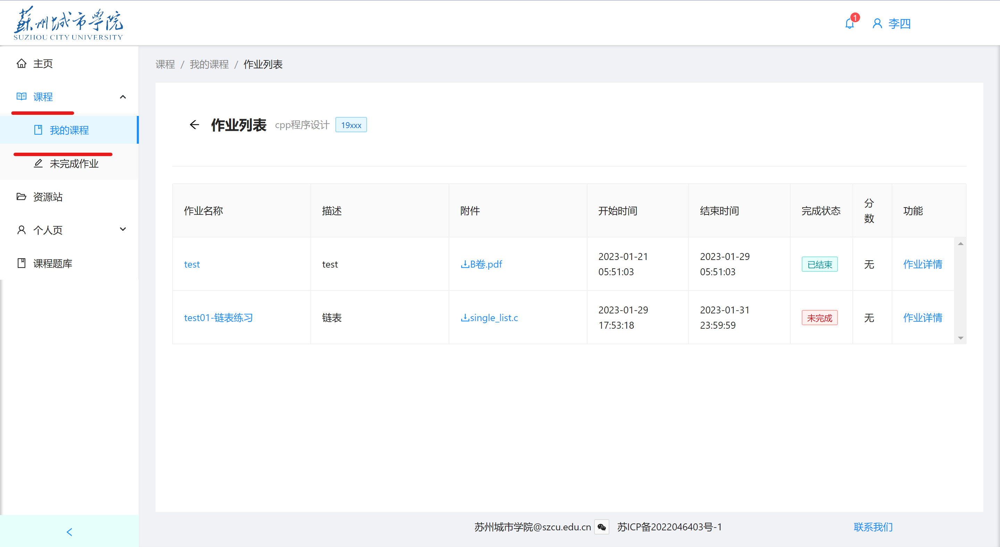
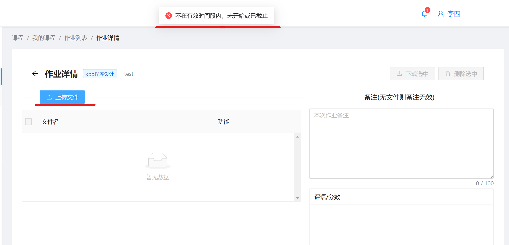
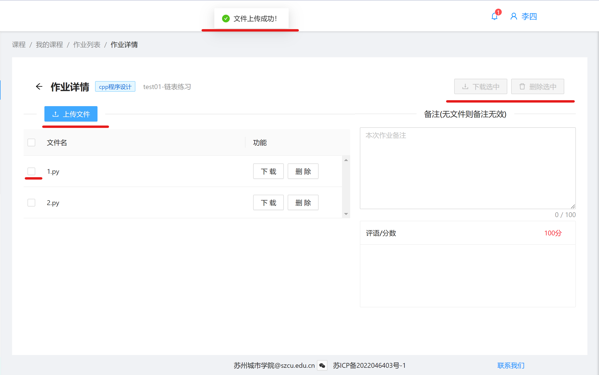

# 作业提交

登录学生账号后，点击左侧，选择栏中 **课程** ， **我的课程**。

如图所示，选择相应的课程。点击进入。

列表第一项作业test已经截止。点击作业名称（表中左方蓝色标签），即可进入提交作业界面。
可以提交文件和备注。（如果老师的作业要求提交报告文件或仅仅需要简单阐述说明，按照实际情况选择不同提交内容）

对于已经截止的作业，点击上传文件会爆出警告。

**注意！老师可以提前布置作业，设定开始时间，当你想提前提交作业时，时间不在有效期内，依旧会弹出上图所示警告。**

对于  test01-链表练习  这个作业，允许多次上传文件并弹出提示。

**当您提交文件后，您的本次作业自动保存云端，已经处于提交状态。即当你每一次更新作业的状态（例如上传文件，删除文件，修改备注），作业自动保存并上传。**

每一项文件左侧有复选框，允许多项选中，之后右上角的灰色按钮会高亮可选，即文件不仅仅提供了单个的下载和删除，还提供了复选多项操作下载和删除。