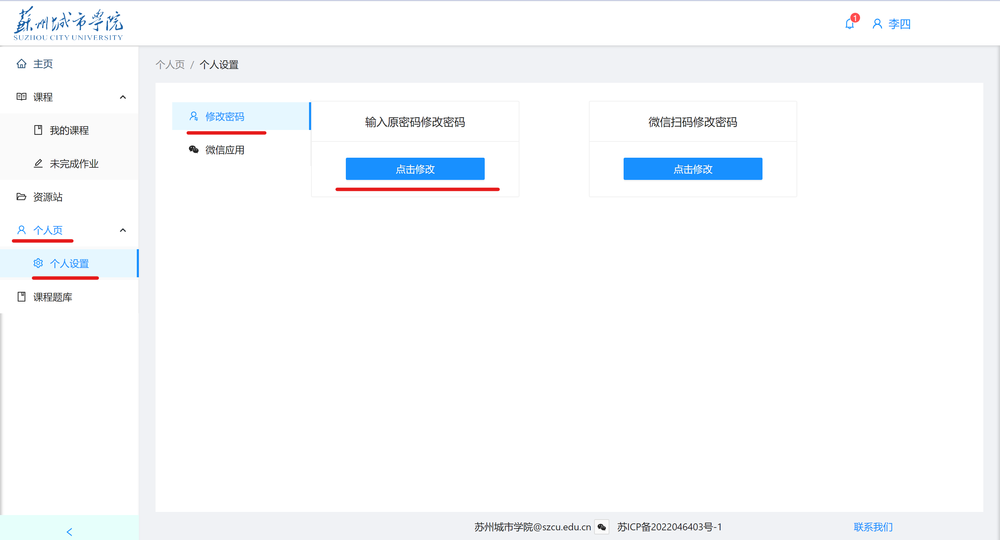
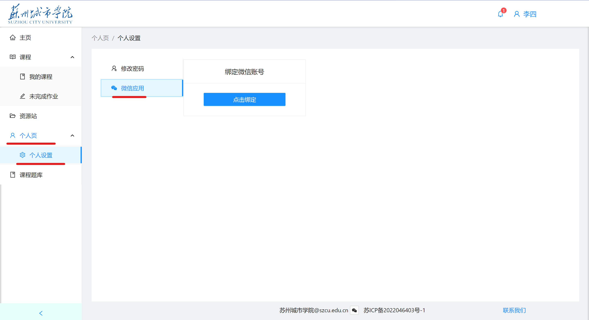
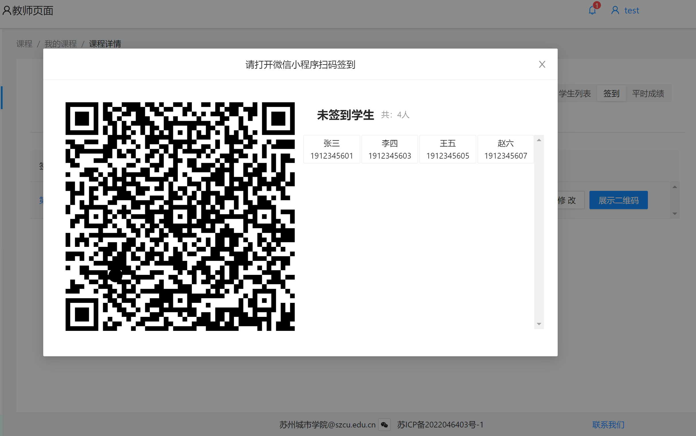

# 扫码签到

## 前置
请务必阅读**tutorial-登录**模块中的**学生-登录**文章。

在首次登录后，请立即更改密码。

## 微信绑定

利用原生微信扫码即可完成绑定，同时跳转到的小程序即是未来提供签到功能的地方。**建议学生收藏该小程序**

## 进行签到

类似雨课堂。本系统是先由老师利用在线教学设备进行登录后，在本课程页面创建签到，并展示一个二维码。

学生仅需要，打开手机，打开原来绑定时的小程序，点击签到按钮，扫码该二维码即可（二维码动态变化，保证无法截图保存再进行扫码签到，请同学们务必在场及时签到）

同时附出该小程序的二维码：

