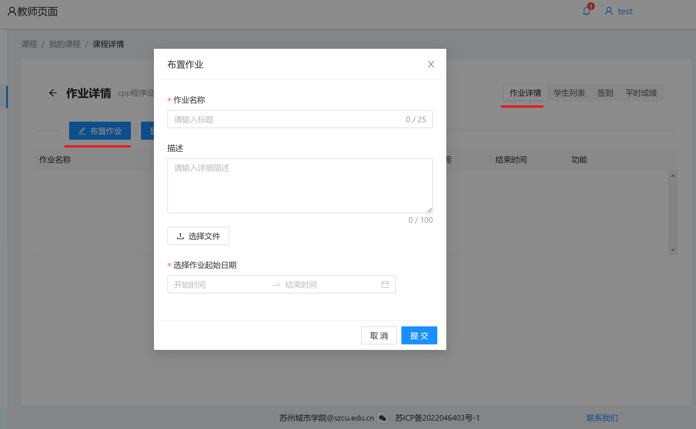
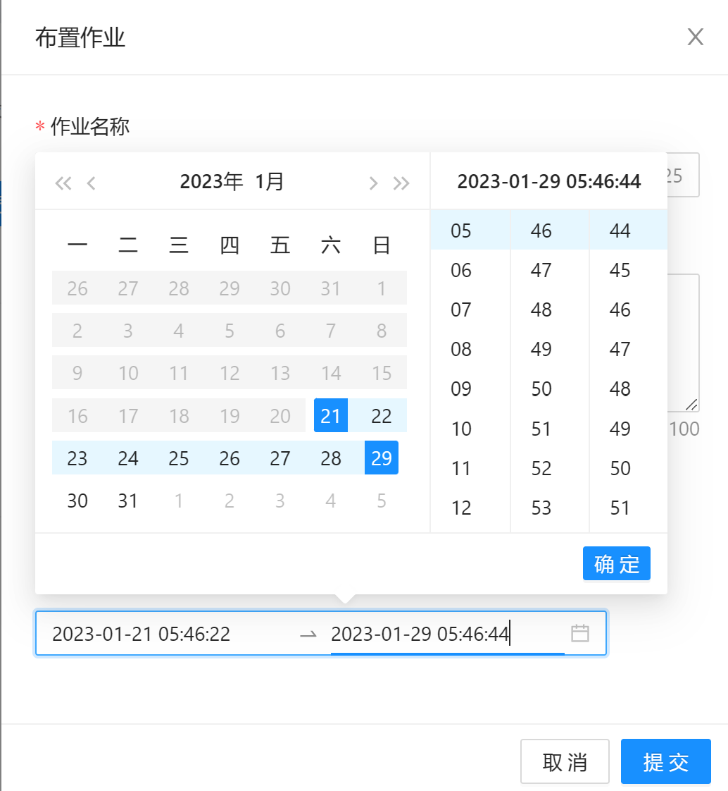
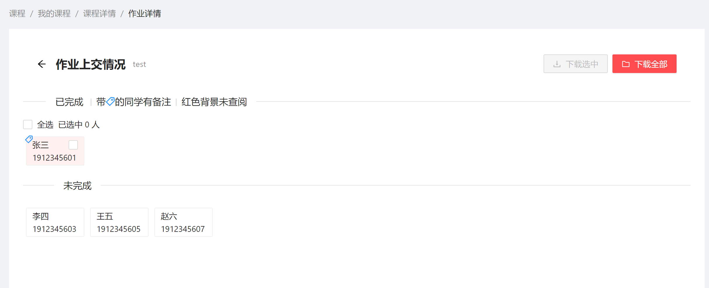
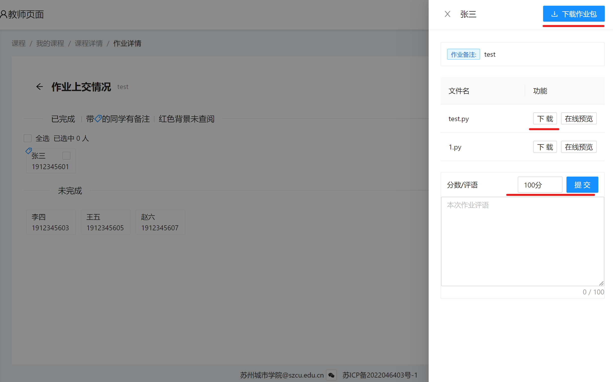

# 作业

## 布置作业

点击某课程进入，点击右上角**作业详情**即可**布置作业**

在填写完作业名称后，可以选择作业文件上传（通常可以上传实验报告，或者有关作业的辅助文件）
也可以在备注上简短写下作业需求。

注意务必设定作业时间

左侧为日期，选中今天，即可立马跳出当前时间自动填充，然后选中后续截至日期即可。
右侧三栏，依次为  时、分、秒  。

如若想布置无期限作业，可以尝试尽可能拉长作业时限。

**先点击时间上的确定按钮。即可正确设定时间**

最后点击**提交**按钮即可。

## 修改作业

点击某作业右侧**修改**按钮即可进入编辑界面。修改并再次提交即可。

## 批改作业

点击作业名称下面，具体的某作业。即可进入作业上交情况详情

点击未批阅的学生，右侧弹出作业详情。可以查看作业备注（部分简单作业，学生会将答案填写在备注里），也可以下载学生提交的作业文件，点击单个文件右侧下载，即可下载单独该份文件。也可以点击右上侧**下载作业包**按钮，下载该学生全部作业文件的压缩包。

写下分数（100分制）和选填评语。点击**提交**按钮即可。

已提交学生成绩默认为100分，教师根据完成情况可以进行打分，若不做修改则默认满分

如果你想修改之前批改过的学生作业，（例如修改分数等），仅需要点击该学生按钮，再次进入上图的编辑页面，进行修改分数，点击**提交**按钮即可。

注意：学生可以重复修改ta所提交的作业，您仅需要再次进入查看即可，系统保证实时动态更新学生的作业提交情况。