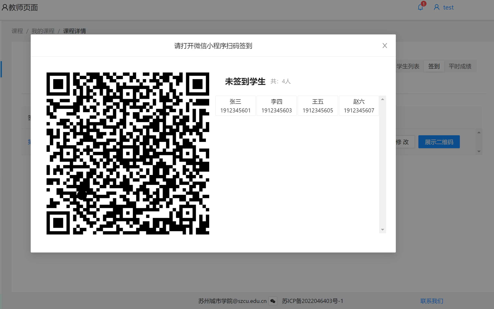
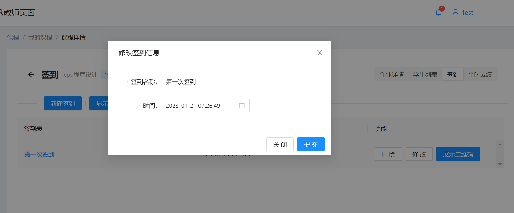
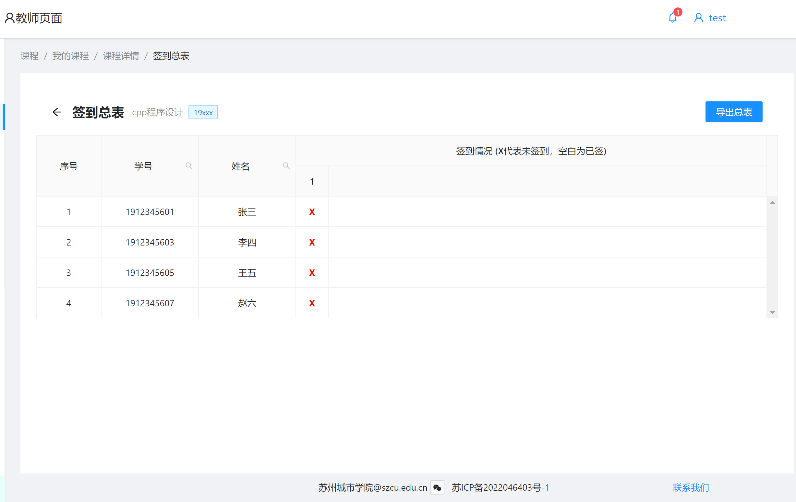

# 签到

签到涉及学生的平时分

## 添加签到

点击上方**新建签到**即可。
该课程的所有签到就会自动排序，针对该课程全班同学。

通常新建完签到后，
需要点击该次签到右侧**展示二维码**

## 修改签到
点击右侧**修改**按钮

可以重命名本次签到，或者修改具体签到时间

## 删除签到

点击**删除**按钮，并点击**确定**即可删除本次签到

## 显示总表
展示学生总体签到情况

点击上侧，**显示总表**按钮，即可查看

