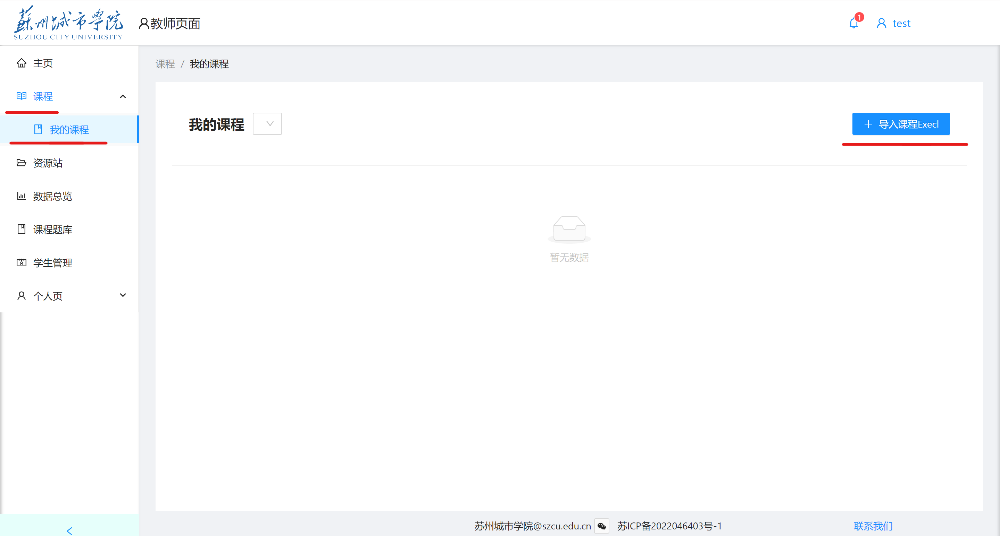
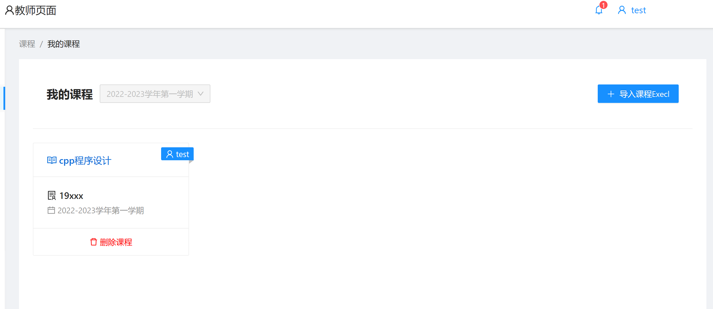
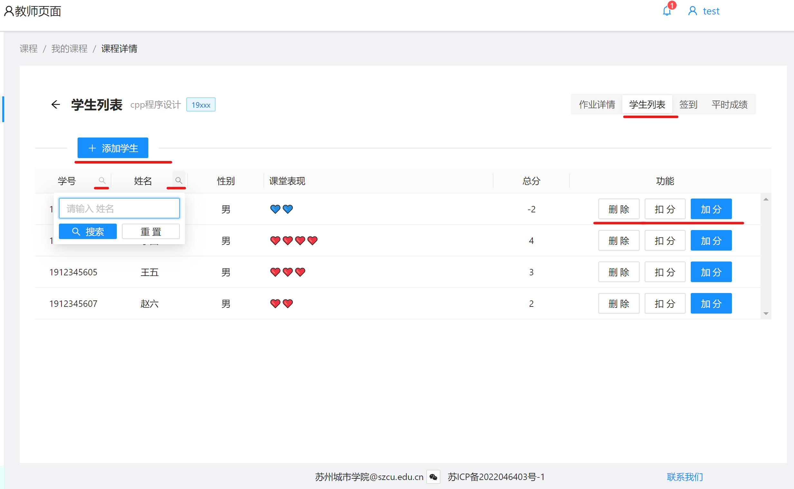
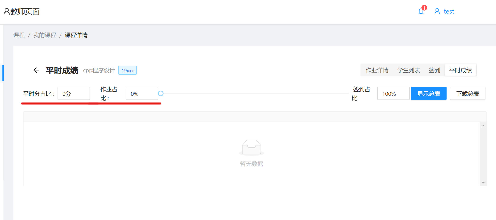
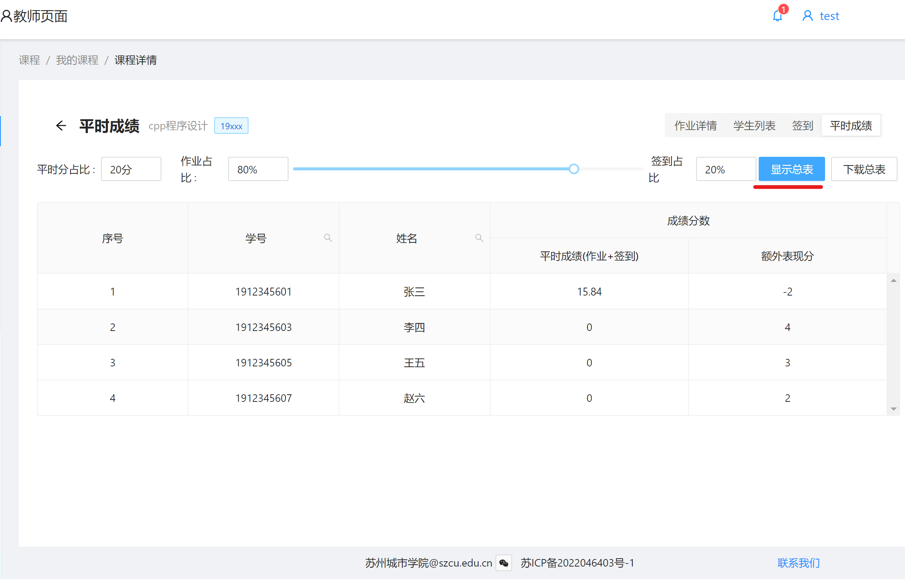

# 课程与平时成绩

## 导入课程

教师首次登录后，需要进行导入课程将该课程包含的所有学生以及课程信息导入系统，进行过程化教学的准备。

首先进入学校官网，[教务系统](http://jwxt.szcu.edu.cn/)。下载对应课程的excel文件。

返回本系统，点击左侧，**课程** -> **我的课程** 中的右上角 **导入课程Excel**按钮。

选中刚刚下载的excel文件即可，等待系统自动解析导入。

导入后如下图所示。

## 管理课程

注意:导入课程是必要的。这样即可将该课程的所有同学账号导入系统。确保所有上您课程的学生在您提供的Excel表格里面。如此以来该同学即可利用自己的学号进行登录该系统。

### 学生列表
点击课程进入，点击右上角**学生列表**进入

在此处可以查看你所导入的该课程所包含的所有学生信息，同时，学号和姓名两列旁，可以通过点击小问号来进行搜索。

在此教师可以对学生进行表现分（印象分）打分。注意：此分数的目的是为了修正学生的平时分。

当然你也可以点击右侧**删除**按钮来进行删除已经退课的学生，或者不在本课程的学生。

### 平时成绩

进入某课程后，点击右侧**平时成绩**按钮

若弹出“平时分错误”，则是没能正确设置**平时分占比**。

请在该页面上，正确合理设置平时分占比。（使其不为0即可不报错）

右侧，可以设置平时分中，作业与签到的占比。当然其中一方可以为0。即平时分可以全由签到决定或者全由作业决定。

注意可以拖动滑动条来设置作业与签到之间的占比情况。

然后点击**显示总表**按钮，即可查看该课程的班级内所有学生的平时分。（由系统自动生成）

该分数由作业和签到两部分决定。比重由您来决定。（而平时分的总分限额，则是由平时分占比决定，例如你决定该门课的平时分比重应该为20%，则我们系统会为您生成一个总分为20分的包含所有学生的一个计算后的平时分，同时带上您对该学生的印象分以供参考，但不计入实际平时分）

点击**下载总表**按钮，即可下载其对应Excel文件
