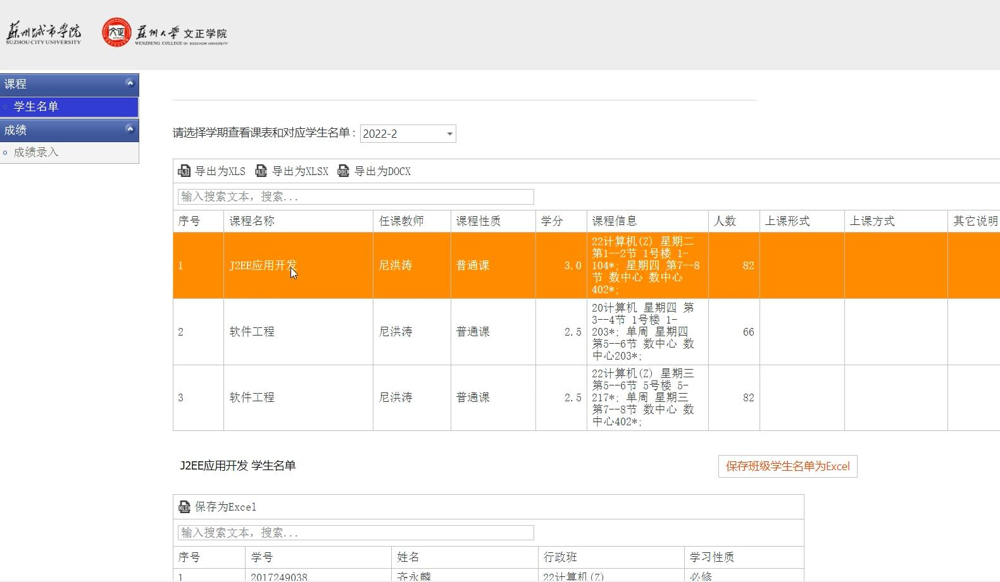

# 课程与平时成绩

## 导入课程

教师首次登录后，需要进行导入课程将该课程包含的所有学生以及课程信息导入系统，进行过程化教学的准备。

首先进入学校官网，[教务系统](http://jwxt.szcu.edu.cn/)。下载对应课程的excel文件。

老师可以登录苏城院教务系统，选择自己的相应课程，点击“保存班级学生名单为Excel”按钮，下载对应课程的学生名单Excel文件。

返回本系统，点击左侧，**课程** -> **我的课程** 中的右上角 **导入课程Excel**按钮。

选中刚刚下载的excel文件即可，等待系统自动解析导入。

**注：教师只能导入自己的课程，否则会报错**

excel如图：

导入后如下图所示。

## 管理课程

注意:导入课程是必要的。这样即可将该课程的所有同学账号导入系统。确保所有上您课程的学生在您提供的Excel表格里面。如此以来该同学即可利用自己的学号进行登录该系统。

### 学生列表
点击课程进入，点击右上角**学生列表**进入

在此处可以查看你所导入的该课程所包含的所有学生信息，同时，学号和姓名两列旁，可以通过点击小问号来进行搜索。

在此教师可以对学生进行表现分（印象分）打分。注意：此分数的目的是为了修正学生的平时分。

当然你也可以点击右侧**删除**按钮来进行删除已经退课的学生，或者不在本课程的学生。

### 平时成绩

进入某课程后，点击右侧**平时成绩**按钮

若弹出“作业次数为0，签到次数为0，无法计算平时分”，则是没有为该课程布置作业和签到所导致的。

同时系统默认该课程的所有学生的**平时分总分**均为**100分**，且不可更改。

当你正确布置签到和作业，并设置比重后：

右侧，可以设置平时分中，作业与签到的占比。当然其中一方可以为0。即平时分可以全由签到决定或者全由作业决定。

注意可以拖动滑动条来设置作业与签到之间的占比情况。

注意：拖动滑动条后，不会实时根据滑动条的状态来动态改变下面总表的状态，即，您需要拖动滑动条后（正确设置比重后），点击**显示总表**按钮，才会根据滑动条的目前占比数值来修改生成下面的总表。

然后点击**显示总表**按钮，即可查看该课程的班级内所有学生的平时分。（由系统自动生成）

该分数由作业和签到两部分决定。比重由您来决定。（而平时分的总分固定设置为100，方便您后续进行折算提供参考，我们系统会为您生成一个总分为100分的包含所有学生的一个计算后的平时分，同时带上您对该学生的印象分以供参考，但这个印象分不计入实际平时分）

点击**下载总表**按钮，即可下载其对应Excel文件
