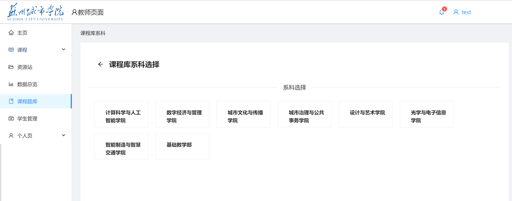
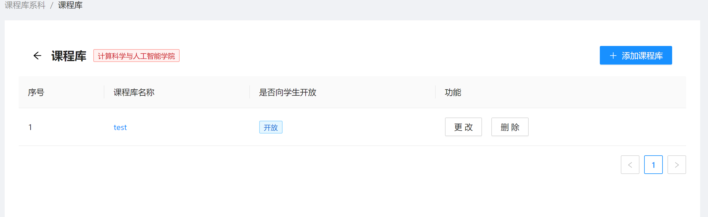
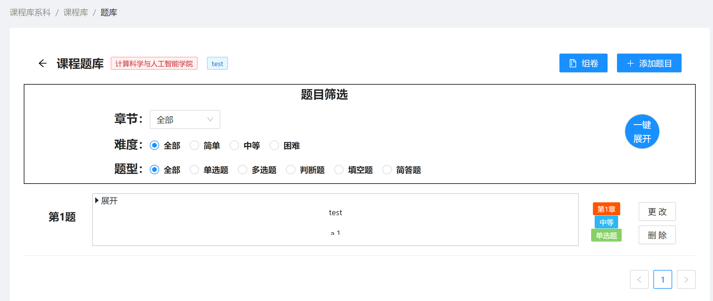
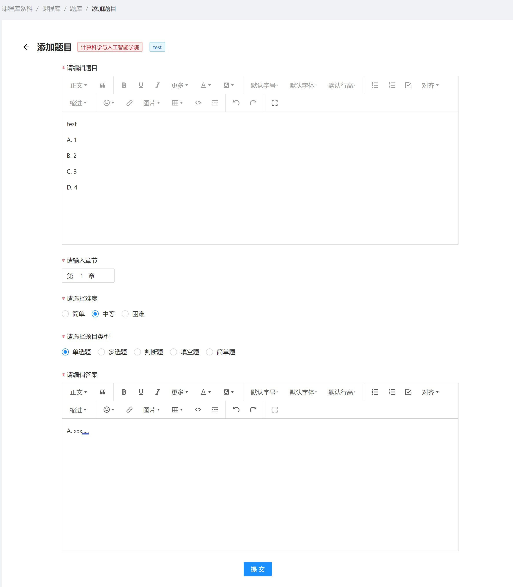
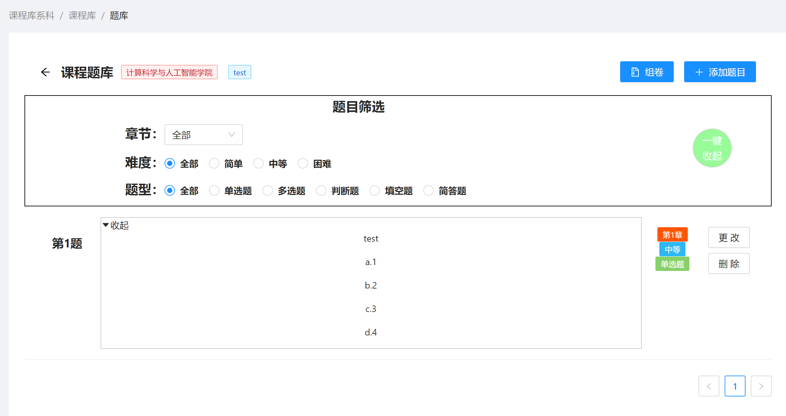

# 课程题库-使用说明

## 简介

课程题库，按照不同学院系科进行分类。但是教师可以自由添加和查看本学院或其他学院的题库（学科融合）。

目的是：
- 组建题库进行累积，形成可重复，可参考，可有效利用的功能型题库
- 为学生提供自我训练的途径，为预习复习做有效准备
- 为其他教师提供参考性的题目，有助于专业的教授与发展。

### 添加题库

选择某学院系科的题库，点击进入。（以 计算科学与人工智能学院 为例）

点击右上角**添加课程库**按钮

填写名字，是否为学生公开。（无论公开与否，教师端都可查看所有题库）
- 公开：为学生建立训练题库
- 不公开：教师内部参考使用

确认即可添加题库成功。

### 更改题库

题库建立之后，在右侧有**更改**按钮，可以进行重命名，和公开权限的重新修改。

### 删除题库

题库的删除涉及题库内部的所有题目的删除。因此在点击删除后，需要验证码的确认。

### 添加题目

进入选定题库，点击左上角**添加题目**按钮。进入富文本编辑界面。

如图所示，可以填充题目题干，并在题目题干处可以给出选择选项。（如若您想添加选择题的话）

然后选择章节，注意这个是必须的，并只能在第1~n章选择。（教师可以自行分类章节，但是不能空白该项）

选择难度等级，注意这个也是必要且重要的。涉及后续的出卷和自动组卷功能，请各位教师斟酌好难度等级。

题目类型有5种，单选题、多选题、判断题、填空题、简答题。均可以用富文本的方式展现出来。

最后需附上参考答案。点击提交
end，添加题目完成

退出可查看该题库的所有题目

### 更改题目

点击题目右侧**更改**按钮，可再次进入添加题目的编辑界面，在此进行修改。并再次提交。

### 删除题目

点击题目右侧**删除**按钮，可以删除该题目，点击确认，即可删除。