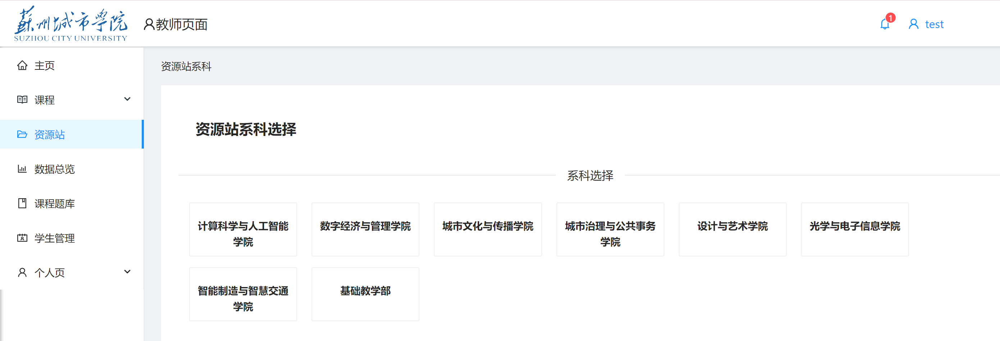
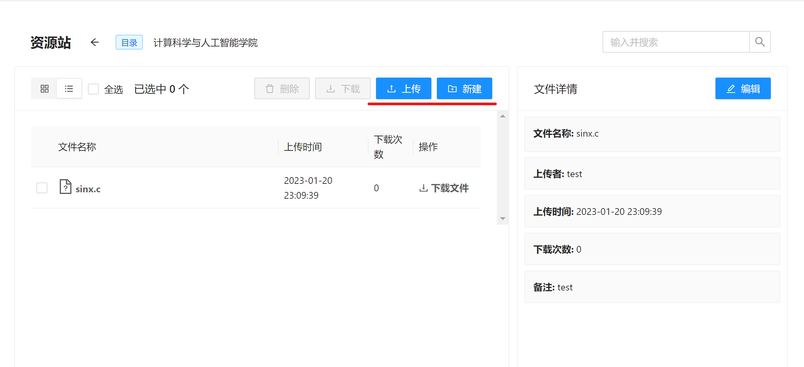

# 资源站-使用说明

## 资源站简介

资源站是为学生和老师自主学习，课程资源，代码文件等提供的一个分享平台。

教师可以自由上传资源，并命名或添加备注，以供该学院的学生和其他教师使用。当然其他学院也可查看。

## 上传

点击如图所示的**上传**按钮，可以选择文件进行上传单个资源。

如若您想上传的是一系列或一套资源文件，可以点击**新建**按钮，建立一个文件夹并命名，然后进入该文件夹，依次上传文件。

**注意！！！ 资源站内文件名字不可修改，为原先上传时文件的源名字。如若您想重命名修改文件，请先删除，然后在电脑端修改文件名字，再上传。**

## 编辑

点击**编辑**按钮，可以修改文件备注。

## 删除

多选或单选文件，点击上面**删除**按钮即可。